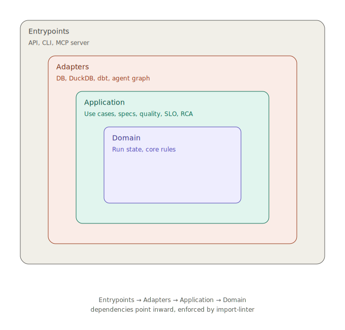

# Keel

Keel is a governed data-platform capstone: declarative pipeline specs, schema contracts, drift detection, dbt-backed transforms, quality gates, lineage, SLOs, incidents, read-only MCP tools, and a deterministic data-ops RCA agent.

> **Status:** Build complete through M9. 319 application/unit tests run with no external services; a further 24 integration tests exercise the Postgres control plane and the dbt transform runner (require `docker-compose up` + `dbt` on PATH). See [docs/BUILD_LOG.md](./docs/BUILD_LOG.md) for the day-by-day build log.

## Why It Exists

At scale, bespoke pipelines produce inconsistent contracts, silent staleness, weak lineage, and noisy incident response. Keel is the paved road: producers declare the dataset they intend to publish, and the platform reconciles, runs, gates, observes, and diagnoses it.

The flagship scenario is failure-shaped: an upstream schema change tries to break downstream consumers. Keel rejects it by default. If someone forces it through with an audited override, the platform contains the damage with quarantine, one grouped incident, and a deterministic RCA dossier.

## Highlights

A few of the design decisions worth a closer look:

- **Contract compatibility engine.** Instead of a hand-maintained table of breaking-change rules, the compatibility check reduces to one invariant — a new contract must accept every dataset the old one accepted — plus a rule that columns can't be silently dropped. Breaking changes are rejected by default with a structured diff; overriding them is explicit and audited.
- **Quarantine over propagation.** A quality check is a monitor that's allowed to say no. It always records an audit row, then blocks or proceeds. Blocking reuses the same saga-style rollback used for run failures — bad data is compensated away before it reaches anything downstream — and a check that couldn't even run still blocks, rather than waving data through.
- **Incident grouping by root cause.** Dedup is a graph problem before it's a notification problem: find the connected component of breaching subjects, then use lineage direction to pick the root incidents actually worth paging on. One upstream failure produces one page, not one per downstream table.
- **Agent guardrails at the narrator boundary.** The agent's only untrusted surface is the LLM-written narration. It may reword a runbook line, but if it drops the machine-verified evidence anchor, the system falls back to the deterministic line. Facts stay structurally immutable across that boundary.
- **Eval-gated RCA, not a vibes check.** A labeled dossier goes into `diagnose`, a ranked hypothesis list comes out, and CI fails the build if top-line accuracy drops or confident-wrong causes rise. LLM-as-judge is deliberately deferred until a model actually owns part of the reasoning.
- **Observability as a thin port.** The application owns a tiny lifecycle port; the adapter translates that into traces, logs, and SLIs. Telemetry never recomputes domain facts — it projects them from the run aggregate after the state machine has already moved.

Full day-by-day build log, including every banked talking point: [docs/BUILD_LOG.md](./docs/BUILD_LOG.md).

## Quickstart

```bash
make install   # install Keel with developer dependencies
make check     # lint, type-check src/evals, run no-service tests, enforce imports
make check-all # run the same gate plus Postgres/dbt integration tests
make demo      # run the narrated breaking-change demo
make seed      # alias for the demo, kept for the advertised seed path
make eval      # run the RCA evaluation gate
```

## Run The Demo

```bash
make demo
```

The demo walks the core governance story:

1. Submit `orders_raw` and a visible fan-out: `raw.orders -> {main.orders_stg, main.revenue_daily, main.customer_ltv, main.fulfillment_health, main.executive_revenue}`.
2. Drop `amount` from the upstream contract and show the compatibility rejection. Nothing ships.
3. Resubmit with `--allow-breaking` and print the audited override.
4. Materialize data missing `amount`, hit the downstream quality gate, quarantine the table, breach the SLO, and collapse the fan-out into one incident group.
5. Assemble the RCA dossier and diagnose the upstream subject.

The same stages are imported by [tests/test_demo_breaking_change.py](./tests/test_demo_breaking_change.py), so the demo is characterization-tested in CI.

Real output from a run:

```text
1. Submit a spec graph
   raw.orders feeds main.orders_stg, main.revenue_daily, main.customer_ltv, main.fulfillment_health, main.executive_revenue (5 downstream datasets)

2. Submit a breaking upstream contract change
   rejected: column_dropped on amount - column was removed from the contract
   nothing shipped: True

3. Resubmit with --allow-breaking
   audited override: True
   version: e0917d1b-c927-417d-b49c-94f9e98548b0

4. Run downstream and contain the blast radius
   quality gate: unknown (not_null check on amount is unknown because no column measurement was available)
   quarantined: run ended failed
   SLO: breaching
   incidents grouped: 1
   assert len(incidents) == 1 group

5. Diagnose the incident
   RCA subject: raw.orders
   top hypothesis: quality_gate_failure (confirmed)
   evidence: run 45403576-1e9b-4785-9744-0981add4e2a8 status failed; failed quality step quality:amount
```

## Architecture



Dependencies point inward and import-linter enforces the boundary. Ports isolate the volatile seams: control-plane storage, warehouse execution, transform runner, MCP reader, telemetry, and the agent graph. DuckDB and dbt-duckdb are local adapters, not architectural commitments.

**Where to start reading:** [`application/specs/compatibility.py`](./src/keel/application/specs/compatibility.py) for the compatibility engine, [`application/agent/diagnose.py`](./src/keel/application/agent/diagnose.py) for the RCA logic, [`application/incident/group.py`](./src/keel/application/incident/group.py) for grouping.

## Tech Stack

Python, FastAPI, Pydantic, SQLAlchemy + Alembic, Postgres, DuckDB, dbt-duckdb, LangGraph, MCP, pytest, ruff, black, mypy, import-linter, docker-compose, GitHub Actions.

## Roadmap

| Milestone | Theme | Result |
|-----------|-------|--------|
| M0 | Foundations | Clean architecture, CI, walking skeleton |
| M1 | Spec & Contract | Declarative specs, parser diagnostics, compatibility engine |
| M2 | Reconciler & Runner | Desired-to-actual planning, idempotent run state, drift checks |
| M3 | Transform | dbt-duckdb execution and manifest-backed verification |
| M4 | Quality & Gates | Freshness, column checks, quarantine semantics |
| M5 | Catalog & Lineage | Dataset catalog, declared lineage, impact traversal |
| M6 | SLO & Incident | Error-budget evaluation, incident routing, grouped blast radius |
| M7 | API & CLI | Self-serve control-plane surface over the application API |
| M8 | MCP + Agent | Read-only MCP tools and eval-gated deterministic RCA |
| M9 | Observability | Executor observer seam, RCA eval gate, packaged demo story |

## ADRs

- [ADR 0001: Freshness clock model](./docs/adr/0001-freshness-clock.md)
- [ADR 0002: Declared-and-verified lineage](./docs/adr/0002-lineage-source-of-truth.md)
- [ADR 0003: Compatibility rules](./docs/adr/0003-compatibility-rules.md)

## Productionization

Keel deliberately stops short of production platform concerns such as auth/SSO, tenant enforcement, multi-region DR, cloud deployment, and full contract-diff observability. Those are documented in [docs/PRODUCTIONIZATION.md](./docs/PRODUCTIONIZATION.md), including the seam where each real implementation plugs in.

## License

MIT
